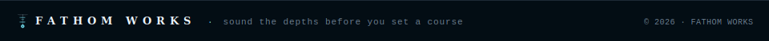

# `$ portainer-mcp-shared`

**A Docker image that wraps [portainer-mcp-enhanced](https://github.com/jmrplens/portainer-mcp-enhanced) with [supergateway](https://github.com/supercorp-ai/supergateway) to expose it as a streamable HTTP MCP server.** This lets you connect Claude or other MCP clients to your Portainer instance over HTTP instead of stdio.

---

## `[ what it does ]`

- Takes the `portainer-mcp-enhanced` binary (which speaks the MCP stdio protocol)
- Wraps it in `supergateway` so it serves MCP over streamable HTTP on port **8000**
- Lets you connect from Claude Code, Claude Desktop, or any MCP-compatible client without running anything locally

---

## `[ quick start ]`

### 1. pull and run

```bash
$ docker run -d \
  -p 8000:8000 \
  -e PORTAINER_URL=https://your-portainer-instance:9443 \
  -e PORTAINER_TOKEN=your-api-token \
  ghcr.io/jemplayer82/portainer-mcp-shared:latest
```

### 2. connect your mcp client

Point your MCP client at:

```
http://localhost:8000/mcp
```

### 3. (optional) skip tls verification

If your Portainer uses a self-signed certificate, add:

```bash
-e PORTAINER_SKIP_TLS_VERIFY=true
```

---

## `[ docker compose ]`

```yaml
services:
  portainer-mcp:
    image: ghcr.io/jemplayer82/portainer-mcp-shared:latest
    ports:
      - "8000:8000"
    environment:
      PORTAINER_URL: https://your-portainer-instance:9443
      PORTAINER_TOKEN: your-api-token
      PORTAINER_SKIP_TLS_VERIFY: "false"
    restart: unless-stopped
```

---

## `[ environment variables ]`

| Variable | Required | Description |
|---|---|---|
| `PORTAINER_URL` | Yes | Full URL to your Portainer instance (e.g. `https://portainer.local:9443`) |
| `PORTAINER_TOKEN` | Yes | Portainer API token |
| `PORTAINER_SKIP_TLS_VERIFY` | No | Set to `true` to skip TLS certificate verification |

---

## `[ getting a portainer api token ]`

1. Log in to your Portainer instance
2. Go to **My Account** (top right)
3. Scroll to **Access tokens** and click **Add access token**
4. Copy the token — you only see it once

---

## `[ how it works ]`

The image is a two-stage build:

1. Pulls the `portainer-mcp-enhanced` binary from its image
2. Drops it into the `supergateway` image alongside a startup script

At runtime, `supergateway` starts `portainer-mcp-enhanced` as a child process (passing your URL, token, and optional TLS flag) and translates its stdio MCP output into HTTP on port 8000.

---

## `[ related ]`

- [portainer-mcp-enhanced](https://github.com/jmrplens/portainer-mcp-enhanced) — the underlying MCP server for Portainer
- [supergateway](https://github.com/supercorp-ai/supergateway) — stdio-to-HTTP bridge for MCP servers

---


